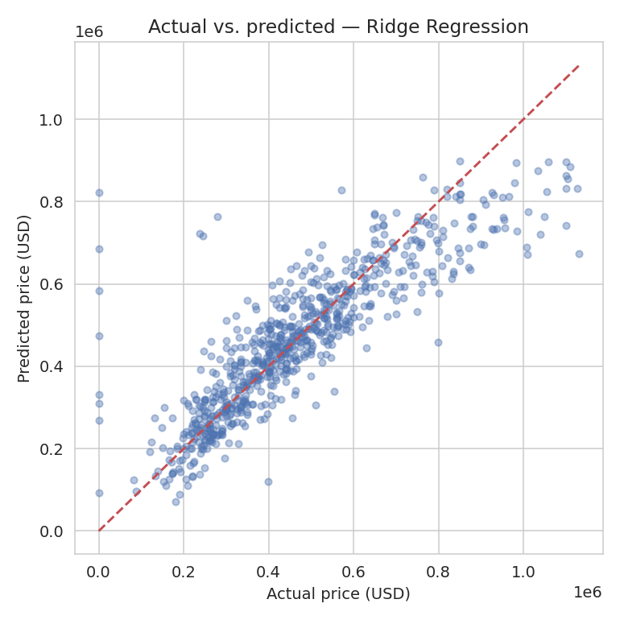
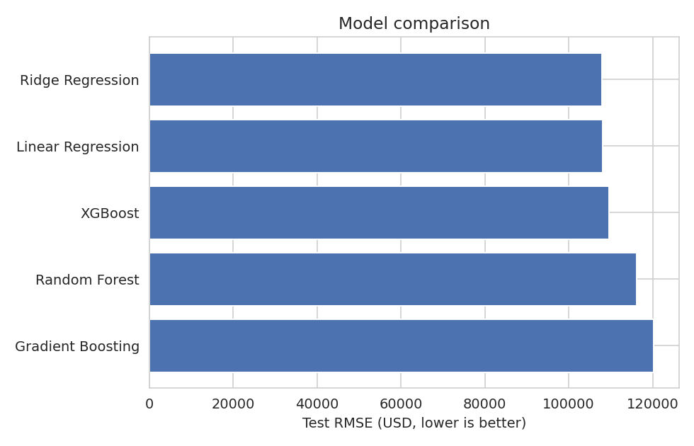
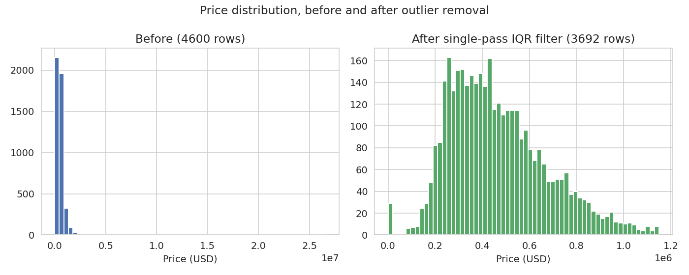
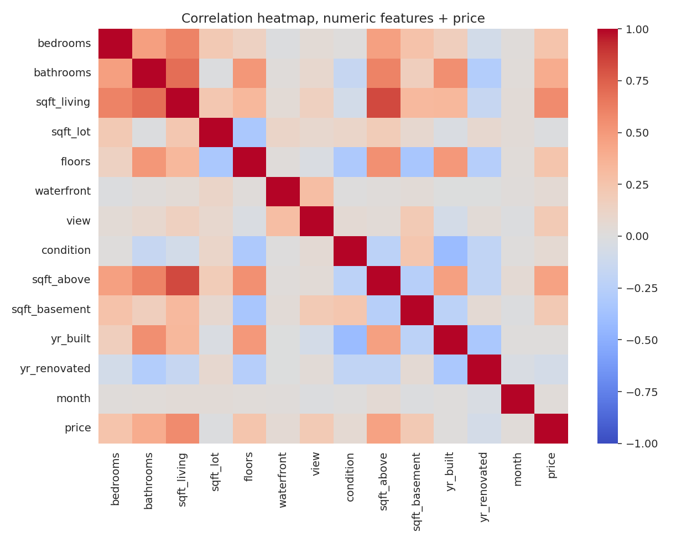
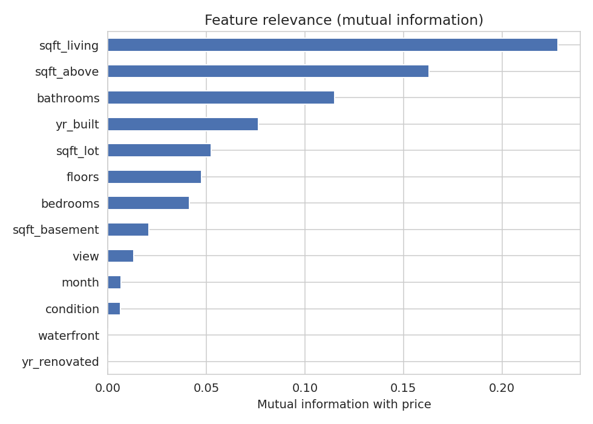
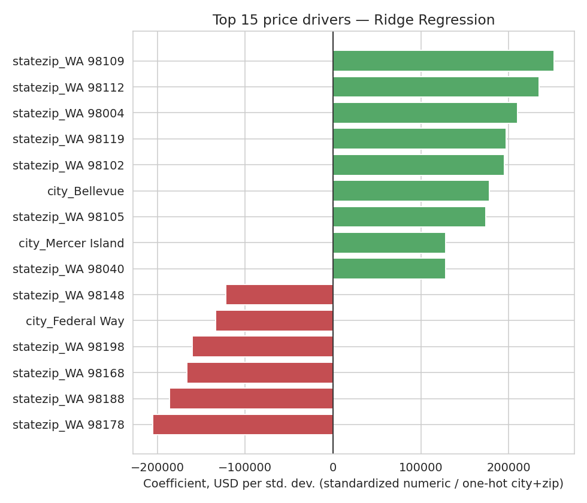

<div align="center">
	<h1>House Price Prediction</h1>
	<p>An end-to-end regression project that turns a small Seattle-area housing
	dataset into a working price-estimation app.</p>
	<p>The project covers the whole path from raw CSV to a usable prediction:
	exploratory analysis, defensible cleaning, feature engineering, model
	comparison, error analysis, and a Streamlit interface for trying individual
	listings.</p>
</div>



## Results at a glance

| | Result |
|---|---|
| Raw listings | 4,600 |
| Listings used after cleaning | 3,692 |
| Selected model | Ridge Regression |
| Test RMSE | **$107,849** |
| Test MAE | **$70,666** |
| Test R² | **0.737** |

The model is not pretending to be an appraisal. It is a compact, reproducible
demonstration of how property size, condition, and location combine to explain
sale prices in this particular slice of the market.

## Run the app

```bash
pip install -r requirements.txt
streamlit run app.py
```

The form accepts the details a buyer or analyst would expect to have on hand:
living area, lot size, bedrooms, bathrooms, condition, view, waterfront status,
year built, renovation history, city, and ZIP code. The saved pipeline handles
scaling and categorical encoding before returning an estimated price.

## Why Ridge won

Five regressors were evaluated with the same preprocessing and an 80/20 train
and test split:

| Model | CV RMSE | Test RMSE | MAE | R² |
|---|---:|---:|---:|---:|
| **Ridge Regression** | **$104,069** | **$107,849** | **$70,666** | **0.737** |
| Linear Regression | $105,914 | $108,108 | $71,183 | 0.736 |
| XGBoost | $109,264 | $109,523 | $72,070 | 0.729 |
| Random Forest | $115,134 | $116,122 | $77,112 | 0.695 |
| Gradient Boosting | $116,026 | $120,284 | $84,550 | 0.673 |

Ridge is a good fit for this dataset's shape: one-hot encoded ZIP codes create
a wide, sparse feature space, while the cleaned dataset is relatively small.
The regularization is enough to keep those location effects useful without
letting the model chase every small neighborhood-specific fluctuation.




## The part that needed real care

The original analysis had the right general idea but two quiet implementation
problems changed its conclusions:

- The model-comparison loop only evaluated the final pipeline constructed. The
	other candidates were created and discarded before scoring.
- The outlier filter treated binary `waterfront` and ordinal `view` columns as
	continuous measurements. Because those columns are heavily skewed, the filter
	removed every waterfront property and every non-zero view score.

This rebuild applies IQR filtering once, only to price and genuinely continuous
size and age fields. That reduces the data from 4,600 to 3,692 listings while
retaining 8 of the 33 waterfront homes. The full investigation, including the
rerun that exposed the original behavior, is in the
[`House_Price_Analysis.ipynb`](notebooks/House_Price_Analysis.ipynb) notebook.

The date column is also handled deliberately: every sale is from 2014, so a
`year` feature would be constant and useless. Only the sale month is retained.

## What the analysis shows



The raw data contains a few extreme sales, including one at $26.6M. After the
corrected filter, the price range is compact enough for a standard regression
model to learn without building a separate luxury-market model.



Living area is the strongest simple numeric signal, followed by above-ground
area and bathrooms. Mutual information gives the same broad story while also
capturing non-linear relationships.



Location has the largest effect in the fitted model. ZIP codes associated with
central Seattle, Bellevue, and Mercer Island sit at the top of the coefficient
chart, while several south Seattle and Kent-area ZIP codes sit at the bottom.



The location result comes with an important limitation: `city` and `statezip`
overlap heavily, and a few categories have very little data. The coefficient
chart excludes categories with fewer than 10 surviving observations, so a
single unusual sale cannot masquerade as a reliable neighborhood effect.

## Reproduce the pipeline

To retrain the model and regenerate the saved artifact:

```bash
python train_model.py
```

To regenerate the charts and metrics used in this README:

```bash
python generate_figures.py
```

The notebook contains the complete exploratory and modeling walkthrough with
outputs, while the Python scripts provide the repeatable production path.

## Project structure

```text
house-price-prediction/
├── app.py                           # Streamlit prediction interface
├── train_model.py                   # Cleaning, comparison, and model training
├── generate_figures.py              # Rebuilds charts and summary metrics
├── house_price_production_model.pkl # Saved sklearn pipeline and metrics
├── data/
│   └── Housing_price_dataset.csv    # 4,600 Seattle-area sales
├── notebooks/
│   └── House_Price_Analysis.ipynb   # Full EDA and modeling walkthrough
├── assets/                          # Figures used in the analysis
├── requirements.txt
└── LICENSE
```

## Data and limitations

The data contains 4,600 Seattle-area listings from May to July 2014 and is
commonly distributed as Kaggle's `shree1992/housedata` dataset. Because it is a
three-month snapshot from one region, predictions should be treated as
historical ballpark estimates, not current market advice.

## License

MIT. See [LICENSE](LICENSE).
